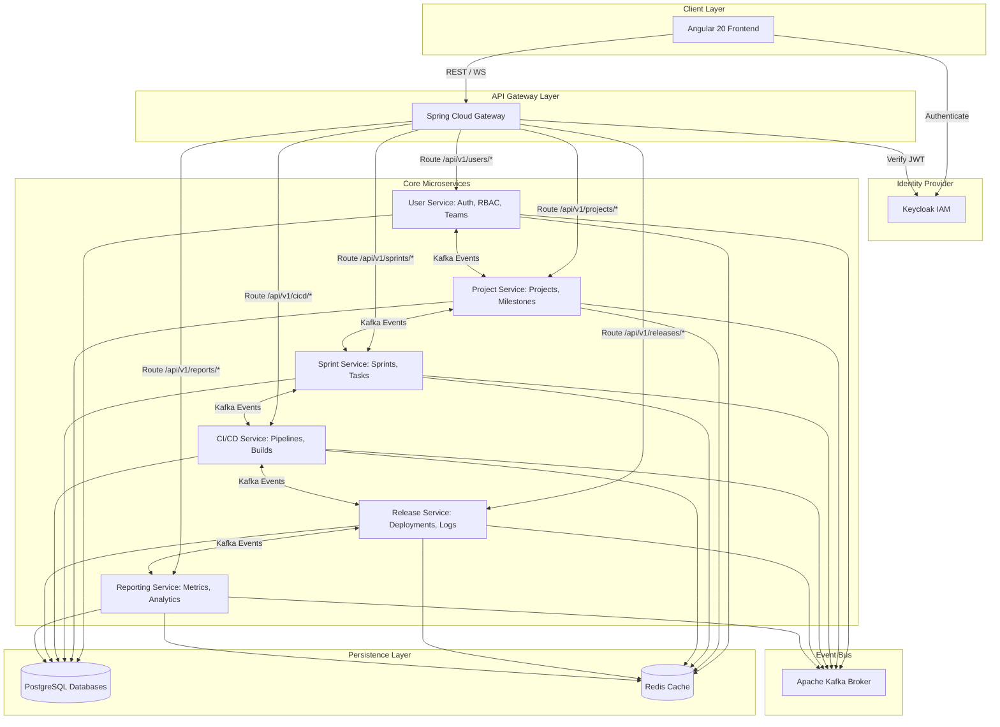

# NeuroForge Nexus Implementation Plan & Architecture Specification

Provide a comprehensive architectural and structural plan for the NeuroForge Nexus Software Development Lifecycle (SDLC) Management Platform, laying the foundation for Milestone 1 and all future milestones.

---

## Executive Summary
NeuroForge Nexus is a next-generation, cloud-native enterprise Software Development Lifecycle (SDLC) management platform designed to orchestrate the entire development process. By uniting requirements, sprint planning, team organization, task management, CI/CD observability, and release tracking under a modular, microservice-driven model, NeuroForge Nexus offers medium and large enterprises a highly scalable, secure, and resilient platform. 

The initial implementation stage (Milestone 1) focuses on building the foundational identity, team structure, project boundaries, sprint planning mechanisms, and high-level milestone tracking, setting the stage for subsequent execution, CI/CD, and DevOps monitoring milestones.

---

## Functional Overview
For Milestone 1, the platform will implement five core pillars:
1. **User & Identity Management**: User registration, profile management, and identity mapping with external provider Keycloak.
2. **Role-Based Access Control (RBAC)**: Fine-grained access management (e.g., Owner, Scrum Master, Developer, QA, Stakeholder) controlling API resource access.
3. **Team Management**: Logical groupings of users into teams, assignment of team leads, and association of teams with projects.
4. **Project Management**: Project definition, goal setting, workspace scoping, and milestone tracking.
5. **Sprint Planning & Milestones**: Definition of project releases/milestones and structured planning of sprints (sprint goals, durations, capacity).

---

## High-Level Architecture Explanation

NeuroForge Nexus is designed as a cloud-native microservice architecture adhering to twelve-factor app principles:



### Flow and Component Details:
1. **Presentation Layer (Angular 20)**: Built on TS/Angular 20 and Angular Material, communicating with the backend exclusively via HTTPS/REST (and WebSockets for real-time updates).
2. **API Gateway (Spring Cloud Gateway)**: Serves as the single entry point. Responsible for request routing, SSL termination, rate-limiting, and preliminary JWT token signature verification.
3. **Identity Provider (Keycloak)**: Acts as the OAuth2 / OIDC server. It manages the master user credentials and issues signed JWT tokens containing roles and user metadata.
4. **Service Isolation**: Each service has its own dedicated database schema inside PostgreSQL (logical databases) to ensure data isolation. Shared data synchronization occurs asynchronously through **Apache Kafka** event payloads.
5. **Caching (Redis)**: Used for distributed session caching, rate-limit state, and high-frequency, slow-changing domain data.

---

## Proposed Microservice Responsibilities

To achieve strong boundaries, the six microservices are assigned distinct responsibilities:

| Microservice | Core Domain & Responsibilities | Milestone Target |
| :--- | :--- | :--- |
| **User Service** | User registration/profiles, team hierarchies, role mappings, and organization scopes. Integrates directly with Keycloak to sync IAM state. | Milestone 1 |
| **Project Service** | Project definitions, high-level roadmaps, milestones, target dates, and team allocation mapping. | Milestone 1 |
| **Sprint Service** | Sprint boundaries (duration, goals, status), sprint backlogs, task definitions, status tracking, and kanban board states. | Milestone 1 & 2 |
| **CI/CD Service** | Webhooks from repos (GitHub, GitLab), pipeline execution logs, build tracing, and deployment history tracking. | Milestone 3 |
| **Release Service** | Release definitions, artifact version tracking, operational change logs, and production environment tracking. | Milestone 4 |
| **Reporting Service** | Velocity charts, burndown/burnup calculations, pipeline success rates, deployment frequencies, and team metrics. | Milestone 4 |

---

## Recommended Package and Module Organization

We propose a monorepo structure containing three primary top-level folders: `/backend` for Java services, `/frontend` for the Angular application, and `/infrastructure` for Docker, Kubernetes, and local deployment configurations.

### Directory Tree:
```text
/neuroforge-nexus
├── /backend
│   ├── /gateway-service
│   ├── /user-service
│   ├── /project-service
│   ├── /sprint-service
│   ├── /cicd-service            (Scaffolded in MS3)
│   ├── /release-service         (Scaffolded in MS4)
│   ├── /reporting-service       (Scaffolded in MS4)
│   └── /shared-library          (Common configuration, exception mapping, security utils)
├── /frontend
│   ├── /src
│   │   ├── /app
│   │   │   ├── /core            (Guards, Interceptors, Singleton Services)
│   │   │   ├── /shared          (Reusable components, Pipes, Directives)
│   │   │   └── /features        (Feature modules: Auth, Users, Teams, Projects, Sprints)
│   │   └── /styles
├── /infrastructure
│   ├── /docker                  (Dockerfile configurations)
│   ├── /kubernetes              (K8s deployments, services, configs)
│   └── docker-compose.yml       (Kafka, Redis, Keycloak, Postgres local dev runner)
```

### Standard Backend Package Structure:
Each microservice will enforce standard Clean Architecture package conventions:
```text
com.neuroforge.nexus.[service_name]
├── config/                 # Spring configurations (Security, Redis, Kafka, OpenAPI)
├── controller/             # REST Endpoints (API Controllers)
│   ├── dto/                # Immutable Record classes representing requests/responses
│   └── mapper/             # Entity-DTO mapping logic (e.g. MapStruct or manual)
├── service/                # Business logic contracts and implementation classes
│   └── impl/               
├── repository/             # Spring Data JPA Repository interfaces
├── domain/                 # Database entity definitions (JPA annotations)
├── exception/              # Domain-specific exceptions
└── event/                  # Kafka event publisher/subscriber components
```

---

## User Review Required

Please review the following structural decisions, which have been designed to facilitate development and keep the codebase clean:

> [!IMPORTANT]
> **Monorepo Strategy**: We propose utilizing a single monorepo for the entire project. This simplifies dependency management for local development, docker-compose orchestration, and CI/CD pipelines.

> [!WARNING]
> **Keycloak Setup**: To test Authentication and RBAC locally in Milestone 1, we will configure a Keycloak instance via `docker-compose`. We will export a JSON realm import file (`realm-export.json`) so that the local Keycloak automatically initializes with required roles (`ADMIN`, `ORGANIZATION_OWNER`, `TEAM_LEAD`, `DEVELOPER`, `QA`, `STAKEHOLDER`) and test credentials.

---

## Open Questions

Before proceeding to coding, we should align on the following specifications:

> [!IMPORTANT]
> **Q1: Team-to-Project Cardinality**
> - *Question*: Can a team work on multiple projects simultaneously, or is a team strictly assigned to a single project? 
> - *Default Assumption*: We assume a Team-to-Project relationship is **Many-to-Many**, allowing cross-functional teams to work across multiple projects, or multiple teams to collaborate on a single project.

> [!IMPORTANT]
> **Q2: Soft Delete vs. Hard Delete**
> - *Question*: For Projects, Sprints, and Teams, do we perform hard deletes or soft deletes (marking as archived/inactive)?
> - *Default Assumption*: Soft deletes (via an `archived` boolean or status enum) are highly recommended to preserve historical logs and avoid cascade-delete violations on completed Sprints/tasks.

> [!IMPORTANT]
> **Q3: Spring Cloud Gateway vs. Direct Frontend-Service Routing**
> - *Question*: Should the frontend route requests through the gateway-service, or talk directly to the services for local testing?
> - *Default Assumption*: All traffic MUST go through the Spring Cloud Gateway to mimic production deployment, ensuring consistent security filters and URL mapping.

---

## Proposed Changes

Here is the high-level roadmap of files to be created in subsequent milestones:

### 1. Gateway Component

#### [NEW] [gateway-service](file:///C:/Users/Somesh%20som/Desktop/INFOSYS-INTERNSHIP-SOMESH%20S/backend/gateway-service)
- Handles incoming API requests and routes them to user, project, and sprint services.
- Validates JWT tokens using Spring Security OAuth2 Resource Server.

---

### 2. User Service

#### [NEW] [user-service](file:///C:/Users/Somesh%20som/Desktop/INFOSYS-INTERNSHIP-SOMESH%20S/backend/user-service)
- Manages User registration, profiles, organizational hierarchy, and Teams.
- Exposes Keycloak integration to map OIDC users to local database users and synchronize RBAC roles.

---

### 3. Project Service

#### [NEW] [project-service](file:///C:/Users/Somesh%20som/Desktop/INFOSYS-INTERNSHIP-SOMESH%20S/backend/project-service)
- Manages Projects and Milestones (Goals, target deadlines, status).
- Subscribes to User Service events (e.g. `TeamCreated`, `TeamDeleted`) to keep project team references consistent.

---

### 4. Sprint Service

#### [NEW] [sprint-service](file:///C:/Users/Somesh%20som/Desktop/INFOSYS-INTERNSHIP-SOMESH%20S/backend/sprint-service)
- Manages Sprint planning details (sprint name, start/end dates, capacity, sprint goal).
- Associates sprints with projects by querying/referencing project IDs.

---

### 5. Frontend Angular App

#### [NEW] [frontend](file:///C:/Users/Somesh%20som/Desktop/INFOSYS-INTERNSHIP-SOMESH%20S/frontend)
- Standard Angular 20 application with components for logging in, dashboard, team directories, project listings, and sprint boards.

---

## Verification Plan

### Automated Tests
We will write JUnit 5 integration tests and mock tests for every backend service:
- `mvn clean test` on each backend service.
- Integration tests will utilize Testcontainers (or a running local Postgres instance) to test data layers.

### Manual Verification
- **Postman/Swagger API Testing**: Verifying endpoints under `/api/v1/users`, `/api/v1/projects`, and `/api/v1/sprints` via the Spring Cloud Gateway port.
- **Frontend Dashboard Walkthrough**: Verify login redirection through Keycloak, listing projects, creating teams, and scheduling sprints via the Angular UI.
- **Security Validation**: Asserting that unauthorized requests return `401 Unauthorized` and role violations return `403 Forbidden`.
